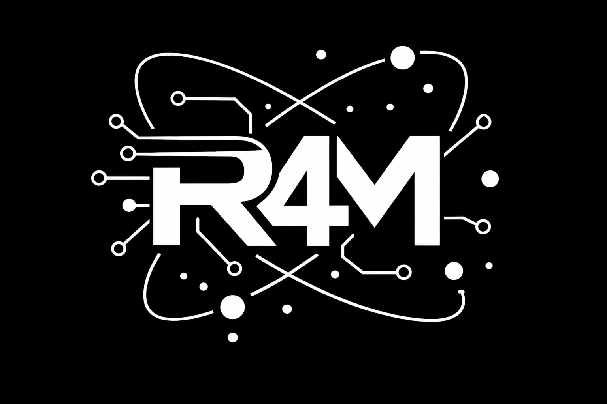

[](https://technical-article-translator.vercel.app/translatia)
[](https://www.python.org/)
[](https://translatia.onrender.com/docs)
[](https://technical-article-translator.vercel.app/translatia)
[](https://technical-article-translator.vercel.app/translatia)
[](https://translatia.onrender.com/docs)
[](LICENSE)

<div align="center">
  
  <h1>⟨/⟩ Translatia — Rs4Machine</h1>
  
  <p><strong>Technical Translation Engine v2.0</strong></p>
  <p>Specialized translator for technical content — preserves AI, engineering and technology terminology.</p>
  <p>
    <a href="https://technical-article-translator.vercel.app/translatia" target="_blank"><strong>🚀 Live App</strong></a> •
    <a href="https://translatia.onrender.com/docs" target="_blank"><strong>📡 API Docs</strong></a> •
    <a href="https://github.com/raphaelmendes-dev"><strong>GitHub</strong></a> •
    <a href="mailto:python.dev.raphael@gmail.com">Contact</a>
  </p>
  <p><em>README em <a href="README.md">Português</a></em></p>
</div>

---

## 🎯 Overview

**Translatia** is a technical article translator built by **Rs4Machine**. Unlike generic translators, it preserves specialized AI, machine learning and engineering terminology during translation, supports full PDF uploads and provides an interactive technical glossary.

- 📄 PDF upload with automatic text extraction
- 🌐 Translation between 7 languages (EN, PT, ES, DE, FR, ZH, JA)
- 🧠 Technical glossary with automatic term detection
- ⚡ Automatic chunking for large documents
- 🖥️ Dark mode interface with Rs4Machine design DNA
- 🔄 Animated scan effect during processing

---

## 🏗️ Architecture

```
translatia/
├── frontend/                        → Next.js 15 (Vercel)
│   ├── app/
│   │   └── translatia/
│   │       └── page.jsx             → Main orchestrator (~180 lines)
│   ├── components/Translatia/
│   │   ├── Header.jsx               → Logo + chips + progress bar
│   │   ├── Toolbar.jsx              → Selectors + PDF upload + button
│   │   ├── TextPanel.jsx            → Original and translated panels
│   │   ├── GlossaryPanel.jsx        → Technical glossary sidebar
│   │   ├── ScanOverlay.jsx          → Animated scan effect
│   │   ├── LanguageSelector.jsx     → Language dropdown
│   │   └── PdfUpload.jsx            → PDF upload → backend
│   ├── hooks/
│   │   └── useTypewriter.js         → Typewriter animation
│   ├── constants/
│   │   └── tokens.js                → Rs4Machine design DNA
│   └── styles/
│       └── translatia.css           → Keyframes + globals
└── backend/                         → Python + FastAPI (Render)
    ├── main.py                      → POST /translate + POST /upload-pdf
    ├── requirements.txt
    └── services/
        ├── translator.py            → Google Translator + protected glossary
        └── pdf_extractor.py         → pypdf — text extraction
```

---

## ✨ Features

- PDF upload with automatic extraction and translation
- Translation between 7 languages with custom selector
- Technical glossary that automatically detects and preserves terms
- Smart chunking for documents over 4500 characters
- One-click language swap
- Animated scan (x-ray) effect during processing
- Real-time word and character counter
- Fully responsive interface with Rs4Machine design tokens

---

## 🛠️ Tech Stack

| Layer | Technology |
|---|---|
| Frontend | Next.js 15 + React |
| Styling | CSS-in-JS + Rs4Machine Design Tokens |
| Backend | Python 3.11+ + FastAPI + uvicorn |
| Translation | deep-translator (Google Translator) |
| PDF | pypdf |
| Frontend Deploy | Vercel |
| Backend Deploy | Render |

---

## 🚀 Running Locally

### Backend
```powershell
cd backend
python -m venv venv
venv\Scripts\activate
pip install -r requirements.txt
uvicorn main:app --reload --port 8000
```

Create `.env` inside `backend/`:
```env
PORT=8000
```

API available at: `http://localhost:8000/docs`

### Frontend
```powershell
cd frontend
npm install
npm run dev
```

Create `.env.local` inside `frontend/`:
```env
NEXT_PUBLIC_API_URL=http://localhost:8000
```

App available at: `http://localhost:3000/translatia`

> ⚠️ Run both terminals at the same time.

---

## 📡 API Endpoints

| Method | Route | Description |
|---|---|---|
| GET | `/` | API status |
| POST | `/translate` | Translate text with preserved glossary |
| POST | `/upload-pdf` | Extract text from PDF |

---

## 🔑 Environment Variables

| Variable | Where | Description |
|---|---|---|
| `NEXT_PUBLIC_API_URL` | frontend `.env.local` | Backend URL |
| `PORT` | backend `.env` | uvicorn port |

---

## 🤝 Contact

**Rs4Machine** — Autonomous Agents Corporation  
CEO: Raphael Mendes  
📧 python.dev.raphael@gmail.com  
🔗 [github.com/raphaelmendes-dev](https://github.com/raphaelmendes-dev)

---

⭐ Star this repo if it helped you!

*Last updated: March 2026*
