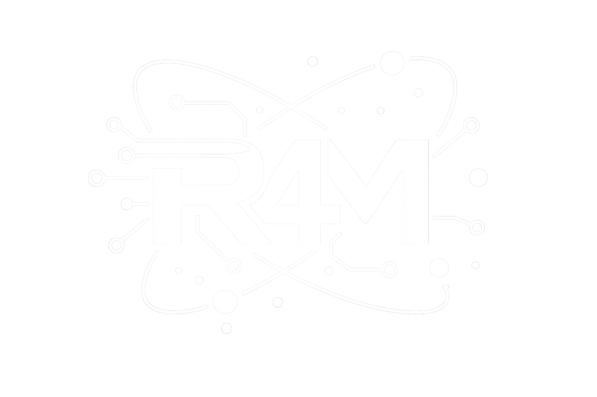

[](https://technical-article-translator.vercel.app/translatia)
[](https://www.python.org/)
[](https://translatia.onrender.com/docs)
[](https://technical-article-translator.vercel.app/translatia)
[](https://technical-article-translator.vercel.app/translatia)
[](https://translatia.onrender.com/docs)
[](LICENSE)

<div align="center">
  
  <h1>⟨/⟩ Translatia — Rs4Machine</h1>
  
  <p><strong>Technical Translation Engine v2.0</strong></p>
  <p>Tradutor especializado em conteúdo técnico — preserva terminologia de IA, engenharia e tecnologia.</p>
  <p>
    <a href="https://technical-article-translator.vercel.app/translatia" target="_blank"><strong>🚀 App Online</strong></a> •
    <a href="https://translatia.onrender.com/docs" target="_blank"><strong>📡 API Docs</strong></a> •
    <a href="https://github.com/raphaelmendes-dev"><strong>GitHub</strong></a> •
    <a href="mailto:python.dev.raphael@gmail.com">Contato</a>
  </p>
  <p><em>README in <a href="README.en.md">English</a></em></p>
</div>

---

## 🎯 Visão Geral

O **Translatia** é um tradutor de artigos técnicos desenvolvido pela **Rs4Machine**. Diferente de tradutores genéricos, ele preserva terminologia especializada de IA, machine learning e engenharia durante a tradução, suporta upload de PDFs completos e oferece um glossário técnico interativo.

- 📄 Upload de PDF com extração automática de texto
- 🌐 Tradução entre 7 idiomas (EN, PT, ES, DE, FR, ZH, JA)
- 🧠 Glossário técnico com detecção automática de termos
- ⚡ Chunking automático para documentos grandes
- 🖥️ Interface dark mode com design DNA Rs4Machine
- 🔄 Efeito de scan animado durante o processamento

---

## 🏗️ Arquitetura

```
translatia/
├── frontend/                        → Next.js 15 (Vercel)
│   ├── app/
│   │   └── translatia/
│   │       └── page.jsx             → Orquestrador principal (~180 linhas)
│   ├── components/Translatia/
│   │   ├── Header.jsx               → Logo + chips + progress bar
│   │   ├── Toolbar.jsx              → Seletores + PDF upload + botão
│   │   ├── TextPanel.jsx            → Painéis original e traduzido
│   │   ├── GlossaryPanel.jsx        → Sidebar glossário técnico
│   │   ├── ScanOverlay.jsx          → Efeito raio-x animado
│   │   ├── LanguageSelector.jsx     → Dropdown de idiomas
│   │   └── PdfUpload.jsx            → Upload PDF → backend
│   ├── hooks/
│   │   └── useTypewriter.js         → Animação typewriter
│   ├── constants/
│   │   └── tokens.js                → Design DNA Rs4Machine
│   └── styles/
│       └── translatia.css           → Keyframes + globals
└── backend/                         → Python + FastAPI (Render)
    ├── main.py                      → POST /translate + POST /upload-pdf
    ├── requirements.txt
    └── services/
        ├── translator.py            → Google Translator + glossário protegido
        └── pdf_extractor.py         → pypdf — extração de texto
```

---

## ✨ Funcionalidades

- Upload de PDF com extração e tradução automática
- Tradução entre 7 idiomas com seletor customizado
- Glossário técnico que detecta e preserva termos automaticamente
- Chunking inteligente para documentos com mais de 4500 caracteres
- Swap de idiomas com um clique
- Efeito de scan animado (raio-x) durante o processamento
- Contador de palavras e caracteres em tempo real
- Interface 100% responsiva com design tokens Rs4Machine

---

## 🛠️ Stack Técnica

| Camada | Tecnologia |
|---|---|
| Frontend | Next.js 15 + React |
| Estilo | CSS-in-JS + Design Tokens Rs4Machine |
| Backend | Python 3.11+ + FastAPI + uvicorn |
| Tradução | deep-translator (Google Translator) |
| PDF | pypdf |
| Deploy Frontend | Vercel |
| Deploy Backend | Render |

---

## 🚀 Como Rodar Localmente

### Backend
```powershell
cd backend
python -m venv venv
venv\Scripts\activate
pip install -r requirements.txt
uvicorn main:app --reload --port 8000
```

Crie o arquivo `.env` na pasta `backend/`:
```env
PORT=8000
```

API disponível em: `http://localhost:8000/docs`

### Frontend
```powershell
cd frontend
npm install
npm run dev
```

Crie o arquivo `.env.local` na pasta `frontend/`:
```env
NEXT_PUBLIC_API_URL=http://localhost:8000
```

App disponível em: `http://localhost:3000/translatia`

> ⚠️ Rode os dois terminais ao mesmo tempo.

---

## 📡 Endpoints da API

| Método | Rota | Descrição |
|---|---|---|
| GET | `/` | Status da API |
| POST | `/translate` | Traduz texto com glossário preservado |
| POST | `/upload-pdf` | Extrai texto de PDF |

---

## 🔑 Variáveis de Ambiente

| Variável | Onde | Descrição |
|---|---|---|
| `NEXT_PUBLIC_API_URL` | frontend `.env.local` | URL do backend |
| `PORT` | backend `.env` | Porta do uvicorn |

---

## 🤝 Contato

**Rs4Machine** — Corporação de Agentes Autônomos  
CEO: Raphael Mendes  
📧 python.dev.raphael@gmail.com  
🔗 [github.com/raphaelmendes-dev](https://github.com/raphaelmendes-dev)

---

⭐ Dê uma estrela se o projeto te ajudou!

*Última atualização: Março 2026*